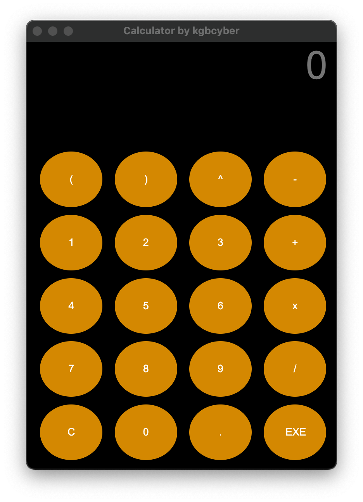

# Calculator GUI in Python

This repository contains a simple calculator Graphical User Interface (GUI) implemented in Python. The calculator allows users to perform basic arithmetic calculations through an intuitive graphical interface.

## Features

- Addition, subtraction, multiplication, and division operations.
- Clear button to reset the input and output fields.
- Decimal point support for floating-point calculations.
- User-friendly interface with buttons for digits and operations.

## Screenshots



## Prerequisites

- Python 3.x

## Getting Started

1. Clone the repository to your local machine or download the ZIP file.

   ```bash
   git clone https://github.com/kgbcyber/pycalc.git
   ```

2. Install python module.
   
   ```bash
   pip install pyqt6
   ```
   
3. Navigate to the project directory.

   ```bash
   cd pycalc
   ```

4. Run the `GUI.py` script.

   ```bash
   python GUI.py
   ```

## Usage

1. Enter numbers using the digit buttons.
2. Click on the operation buttons (+, -, *, /) to select the desired operation.
3. Press the "=" button to calculate and display the result.
4. Use the "C" button to clear the input and output fields.

## Contact

For any questions or inquiries, please email us at kgbcyber@icloud.com.
